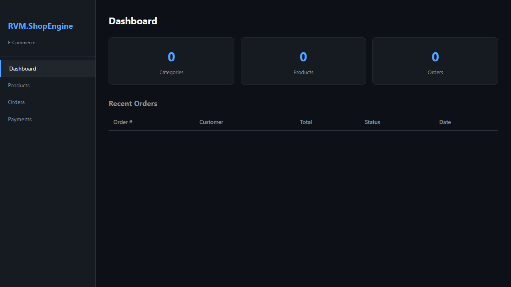
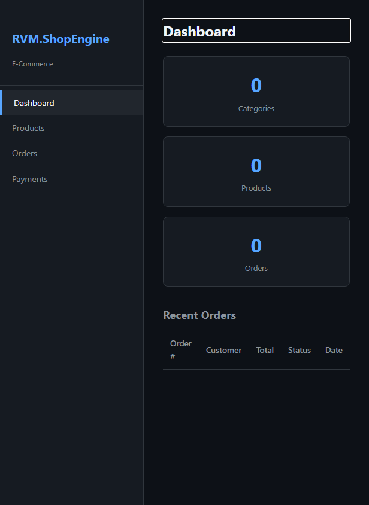
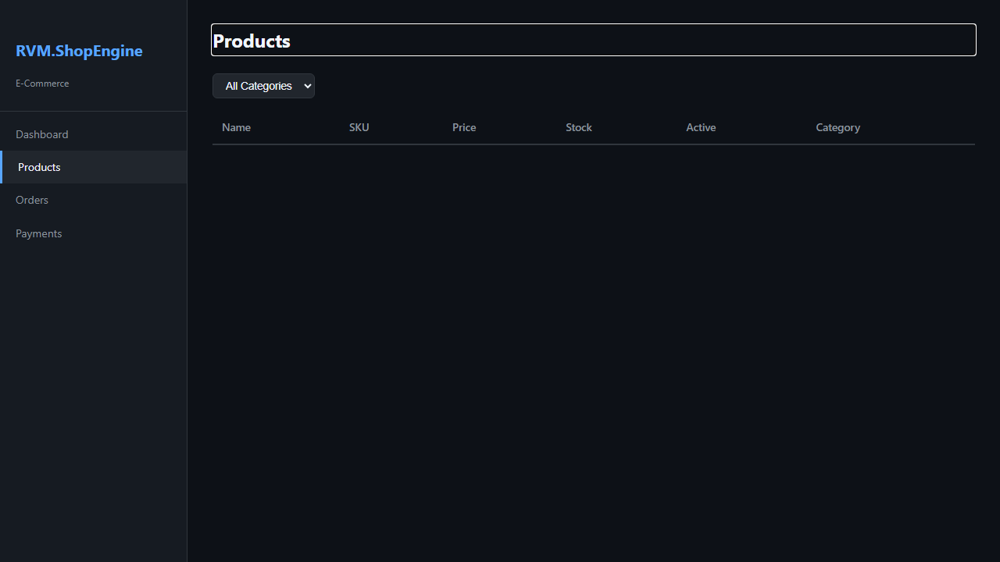
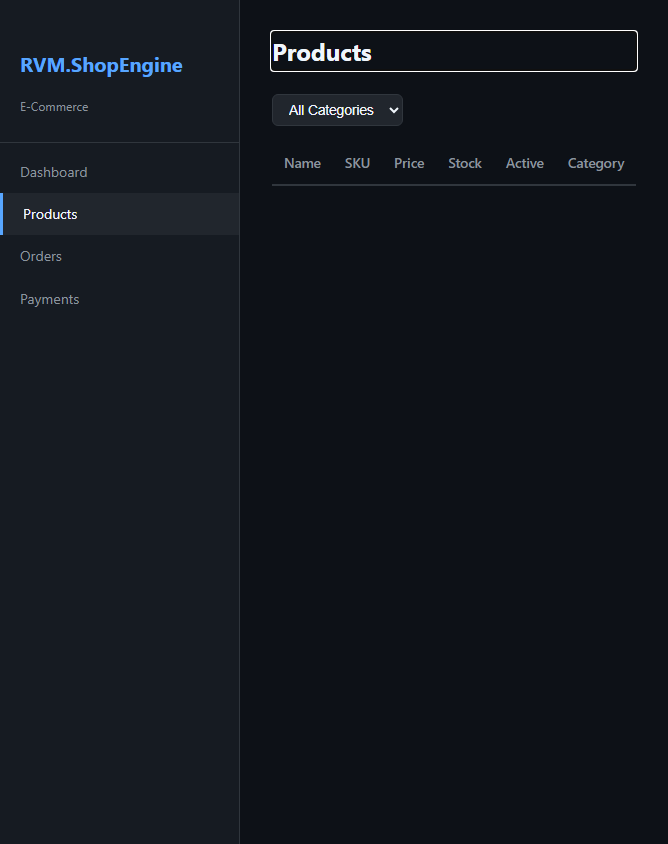
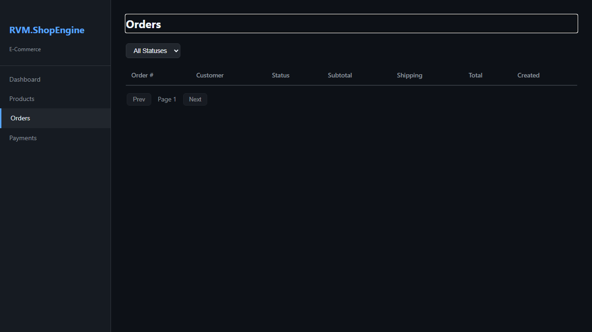
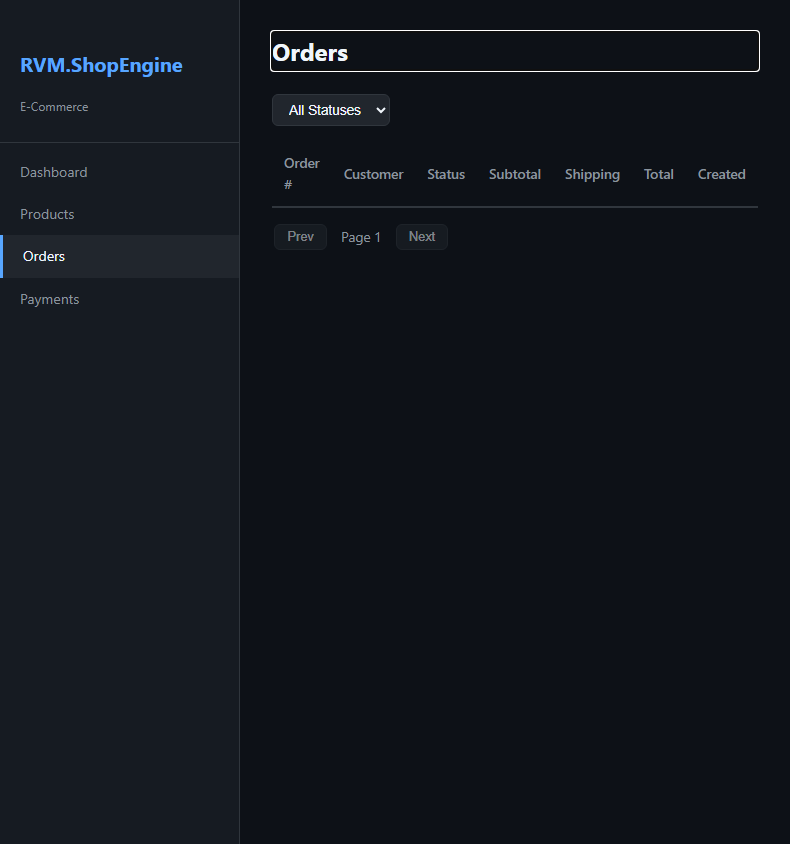
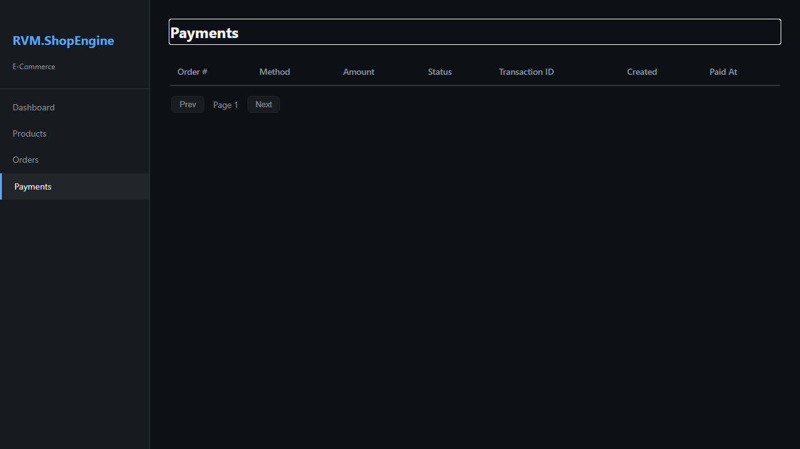
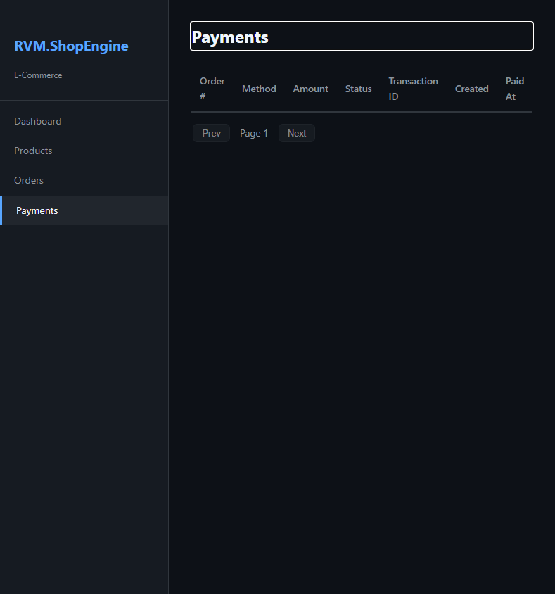

# RVM.ShopEngine - Manual do Usuario

> Plataforma de E-commerce — Guia Completo de Funcionalidades
>
> Gerado em 26/04/2026 | RVM Tech

---

## Visao Geral

O **RVM.ShopEngine** e uma plataforma de e-commerce completa para gestao
de lojas online. Controle produtos, pedidos e pagamentos em um unico painel administrativo.

**Recursos principais:**
- **Dashboard executivo** — metricas de vendas e desempenho em tempo real
- **Catalogo de produtos** — gestao completa com categorias, fotos e estoque
- **Gestao de pedidos** — ciclo completo do pedido ao post-venda
- **Pagamentos** — Pix, Boleto e Cartao de Credito integrados
- **Relatorios** — analise financeira e de vendas por periodo
- **Multi-tenant** — suporte a multiplas lojas na mesma plataforma

---

## 1. Dashboard

Painel central do RVM.ShopEngine com metricas de vendas, pedidos recentes e indicadores de desempenho da loja. Visao executiva em tempo real.

**Funcionalidades:**
- Total de vendas do periodo (dia/semana/mes)
- Numero de pedidos: novos, em andamento e concluidos
- Produtos mais vendidos
- Grafico de receita por periodo
- Alertas de estoque baixo
- Ultimos pedidos com status

> **Dicas:**
> - Use os filtros de periodo para comparar desempenho entre diferentes intervalos.
> - Clique nos cards de metricas para navegar diretamente ao modulo correspondente.

| Desktop | Mobile |
|---------|--------|
|  |  |

---

## 2. Produtos

Gerencie o catalogo completo de produtos da loja. Cadastre itens com nome, descricao, preco, fotos, categorias e controle de estoque.

**Funcionalidades:**
- Listagem de produtos com foto, preco e estoque atual
- Cadastrar novo produto com nome, descricao, SKU e preco
- Upload de multiplas fotos por produto
- Organizacao por categorias e subcategorias
- Controle de estoque com alertas de quantidade minima
- Ativar/desativar produto sem excluir
- Busca e filtros por categoria, preco ou disponibilidade

> **Dicas:**
> - Use o SKU para facilitar o controle de estoque e identificacao nos pedidos.
> - Produtos inativos nao aparecem na loja para os clientes.

| Desktop | Mobile |
|---------|--------|
|  |  |

---

## 3. Pedidos

Acompanhe e gerencie todos os pedidos da loja. Visualize os itens comprados, dados do cliente, endereco de entrega e status de cada pedido.

**Funcionalidades:**
- Listagem de pedidos com status (pendente, confirmado, enviado, entregue, cancelado)
- Detalhes do pedido: itens, quantidades e valores
- Dados do cliente e endereco de entrega
- Atualizar status do pedido com notificacao automatica
- Historico completo de alteracoes
- Filtros por status, data, cliente ou valor
- Exportar lista de pedidos (CSV)

> **Dicas:**
> - Ao atualizar o status para "Enviado", inclua o codigo de rastreamento.
> - Pedidos novos aparecem no topo com destaque em azul.

| Desktop | Mobile |
|---------|--------|
|  |  |

---

## 4. Pagamentos

Gerencie as transacoes financeiras da loja. Acompanhe cobranças Pix, Boleto e Cartao de Credito, com status de pagamento e historico de transacoes.

**Funcionalidades:**
- Listagem de transacoes com status (pendente, pago, cancelado, estornado)
- Detalhes por metodo de pagamento: Pix, Boleto, Cartao
- Data de vencimento e data de pagamento
- Valor bruto, taxas e valor liquido
- Acoes: confirmar pagamento manual, estornar, cancelar
- Relatorio financeiro por periodo
- Integracao com gateway de pagamento

> **Dicas:**
> - Pagamentos Pix sao confirmados automaticamente via webhook.
> - Para estornos de cartao, o prazo de processamento e de 5 a 10 dias uteis.

| Desktop | Mobile |
|---------|--------|
|  |  |

---

## Informacoes Tecnicas

| Item | Detalhe |
|------|---------|
| **Backend** | ASP.NET Core + Blazor Server |
| **Banco de dados** | PostgreSQL 16 + EF Core |
| **Pagamentos** | Pix, Boleto, Cartao de Credito via gateway |
| **Estoque** | Controle automatico com alertas de minimo |
| **Deploy** | Docker Compose + Nginx |

---

*Documento gerado automaticamente com Playwright + TypeScript — RVM Tech*
